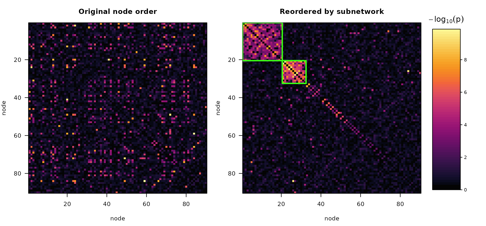

# Multiple subnetworks

``` r

library(subnetr)
```

## More than one subnetwork

Nothing in the method assumes a single subnetwork. A predictor may be
associated with several distinct systems at once, and
[`subnet()`](https://xavienzo.github.io/subnetr/reference/subnet.md)
returns each of them separately, with its own p-value. This article
covers what that looks like, how multiplicity is handled across them,
and where the approach runs out.

We plant two subnetworks of different sizes carrying different effects
in a 90-node connectome.
[`simulate_fc()`](https://xavienzo.github.io/subnetr/reference/simulate_fc.md)
recycles `f2` across `cluster_size`, so each subnetwork gets its own
effect size.

``` r

sim <- simulate_fc(n = 150, n_nodes = 90, cluster_size = c(20, 12),
                   f2 = c(0.08, 0.14), seed = 4)

lengths(sim$truth$nodes)
#> [1] 20 12
```

Node labels are shuffled, so neither block sits conveniently in the
corner of the matrix.

## Detection

``` r

fit <- subnet(sim$W, n_perm = 999, seed = 2)
fit
#> Predictor-associated subnetworks
#> 
#>   nodes       : 90   edges: 4005
#>   objective   : generalized (lambda = 0.50)
#>   threshold   : 1.492   (10.0% of edges retained)
#>   permutations: 999   alpha: 0.05
#>   tuning      : calibrated criterion
#> 
#>  subnet size edges density p_value significant log10_stat
#>       1   20   161   0.847   0.001        TRUE     -128.1
#>       2   12    59   0.894   0.001        TRUE      -50.4
#>       3    8    12   0.429   0.676       FALSE       -5.2
#>       4   11    11   0.200   1.000       FALSE       -1.7
#>       5    8     7   0.250   1.000       FALSE       -1.7
#>       6    7     5   0.238   1.000       FALSE       -1.3
#>       7    9     6   0.167   1.000       FALSE       -0.8
#> 
#> 2 of 7 subnetworks significant at FWER 0.05.
#> P-values are max-statistic permutation p-values and are already
#> family-wise-error corrected; do not adjust them again.
```

Both planted subnetworks come back as separate blocks, and both are
significant. The remaining blocks are what greedy peeling always
produces from leftover noise — the densest block of a random graph is
still a block — and the test correctly declines to call them.

Checking against the truth:

``` r

for (k in seq_along(sim$truth$nodes)) {
  d <- vapply(fit$subnetworks, dice, numeric(1), b = sim$truth$nodes[[k]])
  best <- which.max(d)
  cat(sprintf("planted %d (size %2d): block #%d, Dice = %.2f, p = %.4f\n",
              k, length(sim$truth$nodes[[k]]), best, d[best],
              fit$p_value[best]))
}
#> planted 1 (size 20): block #1, Dice = 1.00, p = 0.0010
#> planted 2 (size 12): block #2, Dice = 1.00, p = 0.0010
```

The two panels below show why reordering matters. On the left the
structure is spread across arbitrary node indices and invisible; on the
right both blocks sit on the diagonal, outlined.

``` r

plot(fit, what = "both")
```



## Blocks are disjoint by construction

Extraction partitions the node set. Each round pulls out the densest
core and hands the *peeled-off* nodes to the next round, so a node can
only ever land in one block.

``` r

sn <- fit$subnetworks
sum(vapply(seq_along(sn), function(i) {
  if (i == length(sn)) return(0L)
  sum(vapply(sn[(i + 1):length(sn)], function(o) length(intersect(sn[[i]], o)),
             integer(1)))
}, integer(1)))
#> [1] 0

anyDuplicated(unlist(fit$partition$blocks))
#> [1] 0
```

Because every node has exactly one home, membership is a single label
per node:

``` r

table(membership(fit))
#> 
#>  0  1  2 
#> 58 20 12
```

`0` is the background. `membership(fit, significant_only = FALSE)`
labels every extracted block instead of only the significant ones.

## Multiplicity is already handled

There is no extra correction to apply when several subnetworks are
reported. Each permutation reruns the **entire** extraction and records
the single most extreme block it produced anywhere in the graph; every
observed block is then compared against that distribution of maxima.
This is the Westfall-Young max-statistic construction, so the p-values
control the family-wise error rate jointly across all blocks returned —
including the ones that fell short.

``` r

as.data.frame(fit)[, c("subnet", "size", "density", "p_value", "significant")]
#>   subnet size   density p_value significant
#> 1      1   20 0.8473684   0.001        TRUE
#> 2      2   12 0.8939394   0.001        TRUE
#> 3      3    8 0.4285714   0.676       FALSE
#> 4      4   11 0.2000000   1.000       FALSE
#> 5      5    8 0.2500000   1.000       FALSE
#> 6      6    7 0.2380952   1.000       FALSE
#> 7      7    9 0.1666667   1.000       FALSE
```

Reporting two significant subnetworks out of seven extracted costs no
additional multiplicity budget. Do not pass these p-values through
[`p.adjust()`](https://rdrr.io/r/stats/p.adjust.html).

## The null is conservative when signal is strong

Each block is tested against `pi0`, the supra-threshold edge rate across
the whole graph. That rate is computed from the observed data, so it
*includes* the signal edges, which makes it larger than the rate among
genuinely null edges.

``` r

wv <- vech(fit$W)
K  <- sum(wv >= fit$threshold)   # supra-threshold edges, whole graph
M  <- length(wv)                 # all edges

sz <- fit$size[fit$significant]
inside_K <- sum(fit$n_edge[fit$significant])
inside_M <- sum(sz * (sz - 1) / 2)

c(pi0_used      = K / M,
  background    = (K - inside_K) / (M - inside_M),
  overstated_by = (K / M) / ((K - inside_K) / (M - inside_M)))
#>      pi0_used    background overstated_by 
#>    0.10012484    0.04827954    2.07385657
```

The test judges each block against a null roughly twice as dense as the
real background. That errs in the safe direction, but it does mean a
weak second subnetwork is harder to detect alongside a very strong first
one than it would be on its own. If you suspect a subtler subnetwork
behind a dominant one, rerunning on the remaining nodes gives it a
cleaner null:

``` r

rest <- setdiff(seq_len(nrow(sim$W)), fit$subnetworks[[1]])
subnet(sim$W[rest, rest], n_perm = 999)
```

Treat that as exploratory. The second pass conditions on the first
result, so its p-values are not jointly corrected with it.

## Power depends on subnetwork size

[`power_curve()`](https://xavienzo.github.io/subnetr/reference/power_curve.md)
accepts a vector `cluster_size` and reports each planted subnetwork
separately. Here both carry the *same* effect size, so any difference in
power is attributable to size alone.

``` r

pw <- power_curve(n = c(60, 100, 150), n_nodes = 90,
                  cluster_size = c(20, 12), f2 = c(0.03, 0.03),
                  n_sim = 50, n_perm = 199, seed = 5, progress = FALSE)

pw$by_cluster
#>     n cluster size   f2 power mean_dice
#> 1  60       1   20 0.03  0.66 0.5164316
#> 2  60       2   12 0.03  0.10 0.1937905
#> 3 100       1   20 0.03  1.00 0.9313475
#> 4 100       2   12 0.03  0.64 0.5457936
#> 5 150       1   20 0.03  1.00 0.9686230
#> 6 150       2   12 0.03  0.92 0.8299895
```

The 20-node subnetwork is found long before the 12-node one. It spans
190 edges against 66, so it accumulates far more evidence at the same
per-edge effect size. Subnetwork size, not just effect size, drives what
a study can find.

The joint summary requires *every* planted subnetwork to be recovered,
so it tracks the harder of the two:

``` r

pw$power[, c("n", "power", "power_recovery", "false_subnet_rate")]
#>     n power power_recovery false_subnet_rate
#> 1  60  0.74           0.10         0.1351351
#> 2 100  1.00           0.64         0.0200000
#> 3 150  1.00           0.92         0.0000000
```

`power` is the chance of declaring anything significant,
`power_recovery` the chance of recovering all planted subnetworks at
`dice_cut` overlap, and `false_subnet_rate` the share of significant
blocks matching nothing planted. When sizing a study aimed at several
subnetworks, size it for the smallest one you care about.

## Where this runs out

The partition is a genuine constraint, not a tuning choice:
**overlapping subnetworks cannot be represented.** If a hub region truly
participates in two distinct predictor-associated systems, peeling will
assign it to whichever block claims it first, and the other will be
reported without it.

If overlap is central to your hypothesis, the block structure here is
the wrong model and you would be better served by a method that permits
mixed membership. If overlap is incidental — a node or two shared
between otherwise distinct systems — the cost is a slightly understated
subnetwork rather than a wrong answer.

## See also

[`vignette("subnetr")`](https://xavienzo.github.io/subnetr/articles/subnetr.md)
for the pipeline end to end, and
[`vignette("power-analysis")`](https://xavienzo.github.io/subnetr/articles/power-analysis.md)
for study design with a single subnetwork.
