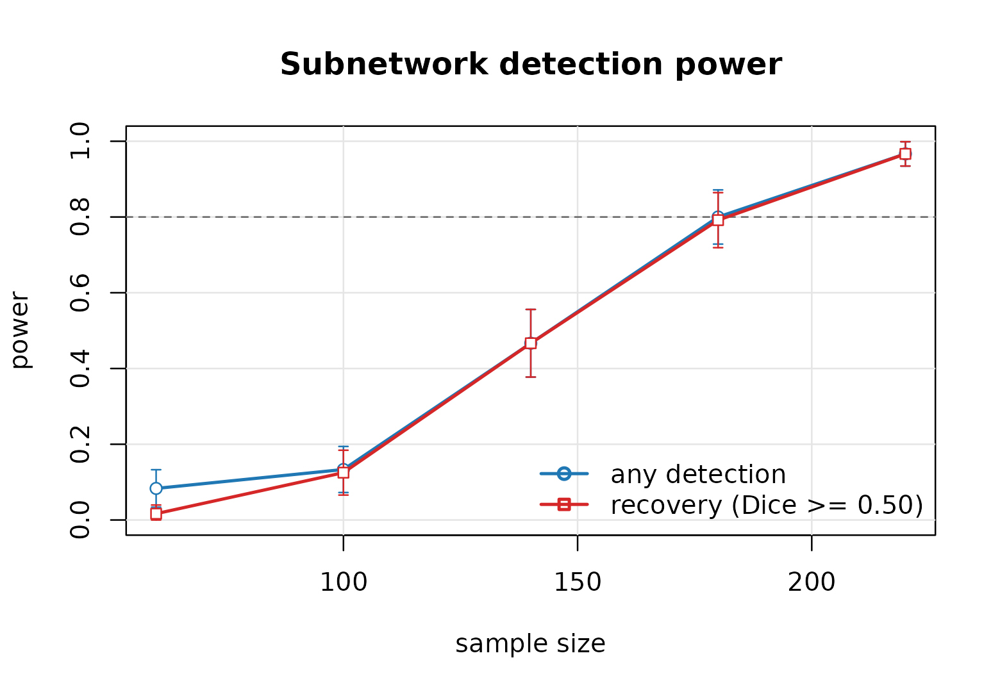

# Power analysis for subnetwork studies

``` r

library(subnetr)
```

## Why simulate

There is no closed-form power calculation for this design. The test
statistic is the binomial tail probability of a block that a greedy
search picked out by maximizing density, compared against a permutation
distribution of the same quantity. Nothing about that is analytically
tractable.

So we simulate the entire pipeline — generate a study, screen it,
extract subnetworks, run the permutation test — and count how often it
works. That is only practical because a full pipeline fit takes
milliseconds; a curve over five sample sizes with 120 replicates each is
over 100,000 extractions and runs in seconds.

## What you need to specify

A power analysis here is a statement about a scenario, and the scenario
has more moving parts than a two-sample t-test.

| argument | meaning | how to pick it |
|----|----|----|
| `n_nodes` | regions in the parcellation | you know this |
| `cluster_size` | nodes in the subnetwork you hope to find | the smallest scientifically interesting one |
| `f2` | Cohen’s $`f^2`$ at an affected edge | from pilot data, or 0.02 / 0.15 / 0.35 for small / medium / large |
| `rho_in` | fraction of within-subnetwork edges actually affected | rarely 1; 0.8–0.9 is realistic |
| `rho_out` | fraction of outside edges affected | scattered associations; 0.01–0.05 |
| `n_cov` | nuisance covariates | age, sex, motion, site |

`f2` is the one people get wrong. At a single edge it is the effect size
of the predictor on that edge’s connectivity, related to the partial
correlation $`\rho`$ by $`f^2 = \rho^2 / (1 - \rho^2)`$. A partial
correlation of 0.14 — which is a perfectly ordinary connectivity effect
— is $`f^2 = 0.02`$.

``` r

rho <- c(0.10, 0.14, 0.20, 0.30, 0.40)
data.frame(partial_r = rho, f2 = round(rho^2 / (1 - rho^2), 3))
#>   partial_r    f2
#> 1      0.10 0.010
#> 2      0.14 0.020
#> 3      0.20 0.042
#> 4      0.30 0.099
#> 5      0.40 0.190
```

## A first curve

``` r

pw <- power_curve(n = c(60, 100, 140, 180, 220),
                  n_nodes = 100, cluster_size = 15, f2 = 0.02,
                  rho_in = 0.9, rho_out = 0.02,
                  n_sim = 120, n_perm = 199, seed = 7, progress = FALSE)
pw
#> Power analysis for subnetwork detection
#> 
#>   nodes           : 100
#>   planted subnets : 15 (sizes)
#>   effect size f2  : 0.02
#>   rho_in / rho_out: 0.90 / 0.020
#>   replicates      : 120   permutations: 199   alpha: 0.05
#>   Dice cutoff     : 0.50
#> 
#>    n         power      recovery  dice n_sig
#>   60 0.083 (0.025) 0.017 (0.012) 0.032  0.08
#>  100 0.133 (0.031) 0.125 (0.030) 0.089  0.13
#>  140 0.467 (0.046) 0.467 (0.046) 0.383  0.47
#>  180 0.800 (0.037) 0.792 (0.037) 0.681  0.80
#>  220 0.967 (0.016) 0.967 (0.016) 0.843  0.98
#> 
#> Power and recovery show the estimate with its Monte Carlo standard
#> error in parentheses.
```

``` r

plot(pw, target = 0.8)
```



``` r

required_n(pw, target = 0.8)
#> [1] 181.9048
```

### Two kinds of power

The two curves answer different questions and the gap between them is
the interesting part.

- **Any detection** — some subnetwork was declared significant. This is
  conventional power, and on its own it is a weak claim: it can be
  satisfied by a significant block that has nothing to do with the one
  you planted.
- **Recovery** — every planted subnetwork is matched by a significant
  one with Sørensen–Dice overlap of at least `dice_cut` (0.5 by
  default). This is the claim you actually want to make, because papers
  report *which regions* are involved.

A study in the gap between the two curves is large enough to detect that
something is there but too small to say where. If your conclusion names
regions, size the study on the recovery curve.

``` r

with(pw$power, data.frame(n, any = power, recovery = power_recovery,
                          gap = round(power - power_recovery, 3)))
#>     n        any   recovery   gap
#> 1  60 0.08333333 0.01666667 0.067
#> 2 100 0.13333333 0.12500000 0.008
#> 3 140 0.46666667 0.46666667 0.000
#> 4 180 0.80000000 0.79166667 0.008
#> 5 220 0.96666667 0.96666667 0.000
```

## The threshold dominates everything

Before trusting any number above, understand the setting that produces
it.

Screening keeps the top few percent of edges. A subnetwork of `c` nodes
spans `c(c-1)/2` edges. If screening retains fewer edges *in the whole
graph* than the subnetwork contains, the subnetwork cannot survive as a
block — no sample size rescues it.

``` r

sweep <- lapply(c(0.99, 0.975, 0.95, 0.90), function(tp) {
  p <- power_curve(n = 120, n_nodes = 80, cluster_size = 20, f2 = 0.06,
                   n_sim = 60, n_perm = 199, seed = 7, progress = FALSE,
                   threshold_prob = tp)
  data.frame(threshold_prob = tp,
             edges_kept = round((1 - tp) * 80 * 79 / 2),
             recovery = p$power$power_recovery)
})
do.call(rbind, sweep)
#>   threshold_prob edges_kept  recovery
#> 1          0.990         32 0.5833333
#> 2          0.975         79 1.0000000
#> 3          0.950        158 1.0000000
#> 4          0.900        316 1.0000000
```

The planted subnetwork here contains `20 * 19 / 2 = 190` edges. At the
99th percentile only 32 edges survive screening in the entire graph, and
recovery collapses. Everything else about the study is unchanged.

[`power_curve()`](https://xavienzo.github.io/subnetr/reference/power_curve.md)
defaults `threshold_prob = NULL`, which scales the threshold with the
design so it retains roughly twice as many edges as the planted
subnetworks contain. That keeps the setting from silently dominating the
answer, but it does not make the dependence go away: **a power figure is
a statement about a particular screening choice and should be reported
with it.**

## Being honest about tuning

The default fixes the threshold across replicates. If your real analysis
will instead tune it on the data — which is what
[`subnet()`](https://xavienzo.github.io/subnetr/reference/subnet.md)
does by default — the simulation should pay the same selection cost,
otherwise it reports power for a procedure you are not going to run.

``` r

honest <- power_curve(n = c(100, 180), n_nodes = 100, cluster_size = 15,
                      f2 = 0.02, n_sim = 40, n_perm = 199, seed = 7,
                      progress = FALSE, tune_each = TRUE,
                      tune = list(n_perm = 10,
                                  lambda_grid = c(0.5, 0.7, 0.9),
                                  probs = c(0.95, 0.975, 0.99)))
honest$power[, c("n", "power", "power_recovery")]
#>     n power power_recovery
#> 1 100   0.2          0.150
#> 2 180   0.9          0.875
```

Shrinking the tuning grid via `tune` is the main lever for making this
affordable.

Note that tuning does not automatically come out *worse*. Two effects
pull in opposite directions: every permutation now has to search the
same grid, which costs power, but the threshold also adapts to each data
set instead of being fixed in advance, which gains power. In this
scenario the second effect wins and `tune_each = TRUE` reports slightly
higher recovery than the fixed default. Which way it goes depends on how
well the fixed threshold happened to suit the design.

The point of `tune_each` is not that it is conservative — it is that it
measures the procedure you will actually run. Quoting power from a fixed
threshold and then tuning at analysis time measures neither.

## Comparing designs

Because everything is fast, sweeping a design parameter is cheap. Does
it pay to increase the parcellation resolution?

``` r

grid <- expand.grid(n_nodes = c(60, 100, 200), n = c(100, 200))
res <- Map(function(nn, n) {
  p <- power_curve(n = n, n_nodes = nn, cluster_size = 15, f2 = 0.02,
                   n_sim = 60, n_perm = 199, seed = 11, progress = FALSE)
  data.frame(n_nodes = nn, n = n, recovery = p$power$power_recovery)
}, grid$n_nodes, grid$n)
do.call(rbind, res)
#>   n_nodes   n  recovery
#> 1      60 100 0.7000000
#> 2     100 100 0.1500000
#> 3     200 100 0.0000000
#> 4      60 200 1.0000000
#> 5     100 200 0.9166667
#> 6     200 200 0.3500000
```

More nodes means more edges to search and a harsher effective
multiplicity for a subnetwork of fixed size, so at a fixed sample size a
finer parcellation costs power for a given absolute subnetwork size.
Whether that is the right trade depends on whether the subnetwork you
care about is a fixed number of regions or a fixed fraction of the
brain.

## Cost and precision

Every reported proportion carries a Monte Carlo standard error, printed
in parentheses and available as `se_power` / `se_recovery`. It shrinks
as $`1/\sqrt{n_{sim}}`$, so halving it costs four times the compute.

``` r

data.frame(n_sim = c(50, 100, 200, 500, 1000),
           se_at_50pct = round(sqrt(0.25 / c(50, 100, 200, 500, 1000)), 4))
#>   n_sim se_at_50pct
#> 1    50      0.0707
#> 2   100      0.0500
#> 3   200      0.0354
#> 4   500      0.0224
#> 5  1000      0.0158
```

Two hundred replicates give about ±0.035 at 50% power, which is enough
to choose between candidate sample sizes. Push to 1,000 only for a
number going into a grant.

Replicates are independent, so `n_cores` scales close to linearly, and
results do not depend on it:

``` r

power_curve(n = c(60, 100, 140), n_nodes = 100, cluster_size = 15,
            f2 = 0.02, n_sim = 500, n_cores = 8, seed = 7)
```

## Reporting

A defensible power statement for this design names the scenario, not
just the number. For example:

> Assuming a 15-node subnetwork within a 100-region parcellation, an
> edge-level effect of $`f^2 = 0.02`$ (partial *r* ≈ 0.14) present in
> 90% of within-subnetwork edges, 2% of edges associated outside it, and
> screening at the 95th percentile of edge evidence, 200 subjects give
> 85% probability of recovering the subnetwork with Dice overlap ≥ 0.5
> at a family-wise error rate of 0.05 (200 simulation replicates, 199
> permutations each; Monte Carlo SE 0.025).

## See also

[`vignette("subnetr", package = "subnetr")`](https://xavienzo.github.io/subnetr/articles/subnetr.md)
for the analysis pipeline itself.
