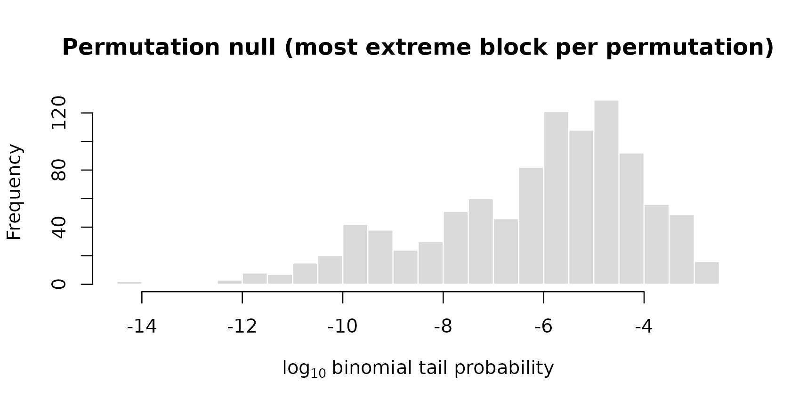
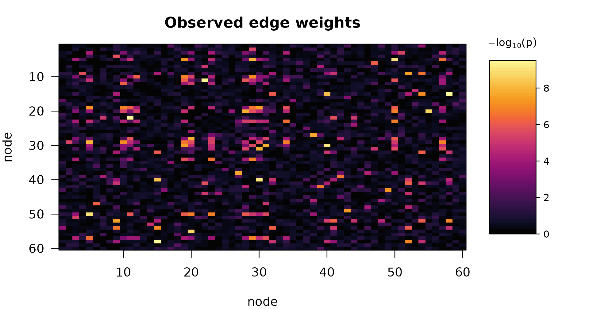
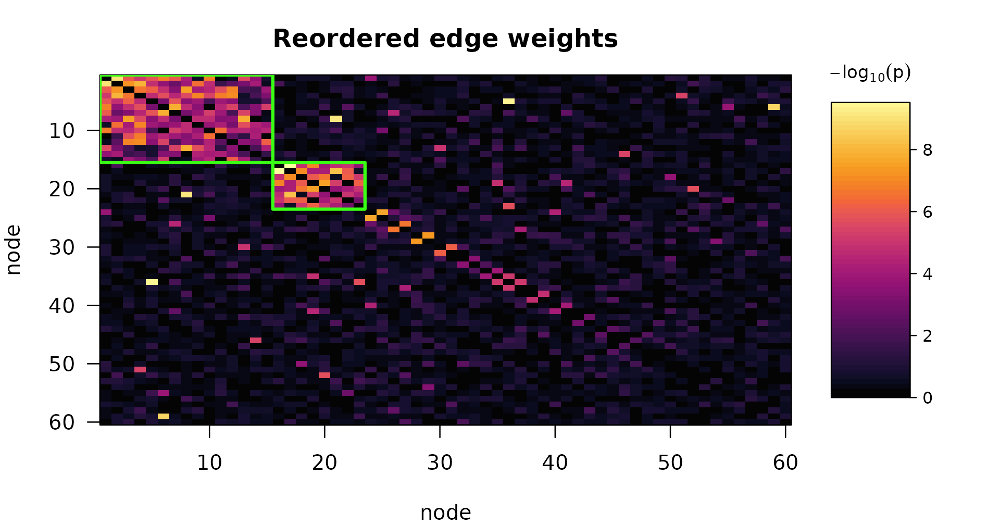

# Getting started with subnetr

``` r

library(subnetr)
```

## The question

A connectome study measures functional connectivity between every pair
of regions and asks how it relates to something about the subject: a
symptom score, a drug dose, an age. With 100 regions there are 4,950
edges, and testing each one separately means paying a multiplicity price
that leaves almost nothing standing.

`subnetr` asks a structured question instead. Rather than “which
individual edges are associated?”, it asks “is there a **set of
regions** whose mutual connections are associated?” — a subnetwork. That
is usually the scientific question anyway, and it is far easier to
answer, because a subnetwork concentrates many weak edge-level signals
into one strong block-level signal.

## The pipeline

Four steps, each a single function.

1.  **[`edge_stats()`](https://xavienzo.github.io/subnetr/reference/edge_stats.md)**
    turns subject-level connectivity into one number per edge: the
    evidence that this edge relates to the predictor, on a
    $`-\log_{10} p`$ scale, adjusted for nuisance covariates.
2.  **[`tune_subnet()`](https://xavienzo.github.io/subnetr/reference/tune_subnet.md)**
    chooses how aggressively to screen those edges, and how the search
    should trade block size against block density.
3.  **[`subnet_extract()`](https://xavienzo.github.io/subnetr/reference/subnet_extract.md)**
    pulls dense blocks out of the screened graph by greedy peeling.
4.  **[`subnet()`](https://xavienzo.github.io/subnetr/reference/subnet.md)**
    does 2–4 and attaches a permutation p-value to each block.

In practice you call
[`subnet()`](https://xavienzo.github.io/subnetr/reference/subnet.md) and
it runs the rest.

## Step 1: from data to a weighted graph

[`edge_stats()`](https://xavienzo.github.io/subnetr/reference/edge_stats.md)
expects connectivity as an `n_subject` × `n_edge` matrix whose rows are
vectorized lower triangles, or as an `n_node` × `n_node` × `n_subject`
array.

``` r

set.seed(42)
n_subj  <- 120
n_nodes <- 60
n_edge  <- n_nodes * (n_nodes - 1) / 2

symptom <- rnorm(n_subj)
age     <- rnorm(n_subj, 40, 12)
motion  <- rexp(n_subj, 5)

fc <- matrix(rnorm(n_subj * n_edge), n_subj, n_edge)
fc <- fc + outer(motion, rnorm(n_edge, sd = 0.4))   # a nuisance effect

W <- edge_stats(fc, x = symptom, covariates = cbind(age, motion))
dim(W)
#> [1] 60 60
round(W[1:4, 1:4], 3)
#>       [,1]  [,2]  [,3]  [,4]
#> [1,] 0.000 0.277 0.300 0.140
#> [2,] 0.277 0.000 0.120 0.147
#> [3,] 0.300 0.120 0.000 0.698
#> [4,] 0.140 0.147 0.698 0.000
```

Each edge is fitted as `y_e ~ symptom + age + motion`. Nothing here
loops over edges: the predictor and the connectivity matrix are
residualized on the covariates once, and the Frisch–Waugh–Lovell theorem
then gives all 1,770 slopes, standard errors and t-statistics in a
couple of matrix products.

P-values are computed on the log scale throughout, so evidence far past
the point where a p-value would underflow to zero is still represented
exactly.

``` r

attr(W, "df")
#> [1] 116
range(attr(W, "t"))
#> [1] -3.238598  3.117976
```

## Step 2: simulating a study with known truth

To see the method work we need a data set where we know the answer.
[`simulate_fc()`](https://xavienzo.github.io/subnetr/reference/simulate_fc.md)
plants subnetworks with a specified effect size.

``` r

sim <- simulate_fc(n = 120, n_nodes = 60, cluster_size = c(15, 8),
                   f2 = c(0.15, 0.25), rho_in = 0.9, rho_out = 0.02,
                   seed = 2024)
sim
#> Simulated connectome study
#>   subjects  : 120   nodes: 60   covariates: 0
#>   planted   : 15, 8 nodes per subnetwork
#>   f2        : 0.15, 0.25   rho_in: 0.90   rho_out: 0.020
#>   method    : fast   signal edges: 151 of 1770
```

The arguments describe a scenario rather than a mechanism:

- `f2` is Cohen’s $`f^2`$, the effect size at an affected edge.
- `rho_in = 0.9` means only 90% of the edges *inside* a planted
  subnetwork actually carry the effect. Real subnetworks are not
  uniformly affected, and a method that only works at `rho_in = 1` is
  not worth much.
- `rho_out = 0.02` scatters associated edges *outside* every subnetwork
  — the false positives any real screen has to cope with.
- Node labels are shuffled, so the planted structure is not conveniently
  sitting in the corner of the matrix.

`sim$truth` holds the answer for scoring:

``` r

lengths(sim$truth$nodes)
#> [1] 15  8
head(sim$truth$nodes[[1]])
#> [1]  3  5 10 11 12 19
```

## Step 3: extraction

[`subnet_extract()`](https://xavienzo.github.io/subnetr/reference/subnet_extract.md)
screens the graph at a threshold and peels dense blocks out of it.

``` r

thr  <- quantile(vech(sim$W), 0.95)
part <- subnet_extract(sim$W, threshold = thr, lambda = 0.6)
part
#> Greedy-peeling partition
#>   nodes           : 60
#>   objective       : generalized (lambda = 0.60)
#>   threshold       : 4.029  (5.0% of edges retained)
#>   subnetworks     : 6
#> 
#>  subnet size edges density
#>       1   13    43   0.551
#>       2    8    20   0.714
#>       3    4     2   0.333
#>       4    4     2   0.333
#>       5    5     3   0.300
#>       6    3     1   0.333
#> 
#>   background      : 23 nodes
```

The algorithm repeatedly deletes the lowest-degree node and scores
whatever remains after each deletion. The best-scoring set becomes a
subnetwork; the nodes deleted before it become the input to the next
round. It stops when the leftovers carry no supra-threshold weight.

### What `lambda` does

The score for a set of `n` nodes carrying total weight `w`, spanning
`m = n(n-1)/2` possible edges, is

``` math
(w/m)^\lambda \cdot w^{1-\lambda}.
```

At `lambda = 1` this is pure density, which favours small tight cliques.
At `lambda = 0` it is pure total weight, which favours large diffuse
blocks.

``` r

sizes <- sapply(c(0.1, 0.3, 0.5, 0.7, 0.9), function(l) {
  subnet_extract(sim$W, threshold = thr, lambda = l)$sizes[1]
})
data.frame(lambda = c(0.1, 0.3, 0.5, 0.7, 0.9), top_block_size = sizes)
#>   lambda top_block_size
#> 1    0.1             42
#> 2    0.3             23
#> 3    0.5             13
#> 4    0.7             12
#> 5    0.9              5
```

Two values of `lambda` are worth recognizing. At `lambda = 0.5` the
score is `w / n`, the average weighted degree, which is the classical
densest-subgraph criterion. As `lambda` approaches 1 the score
approaches edge density, and the extracted block shrinks toward the
tightest small clique in the graph – which is why `min_size` exists.

## Step 4: inference

Extraction on its own will always return *something* — the densest block
of pure noise is still a block.
[`subnet()`](https://xavienzo.github.io/subnetr/reference/subnet.md)
adds the test that decides whether it means anything.

``` r

fit <- subnet(sim$W, n_perm = 999, seed = 1)
fit
#> Predictor-associated subnetworks
#> 
#>   nodes       : 60   edges: 1770
#>   objective   : generalized (lambda = 0.50)
#>   threshold   : 1.757   (10.0% of edges retained)
#>   permutations: 999   alpha: 0.05
#>   tuning      : calibrated criterion
#> 
#>  subnet size edges density p_value significant log10_stat
#>       1   15    88   0.838   0.001        TRUE      -69.6
#>       2    8    25   0.893   0.001        TRUE      -21.6
#>       3    4     4   0.667   0.984       FALSE       -2.9
#>       4   10     8   0.178   1.000       FALSE       -1.1
#>       5    4     2   0.333   1.000       FALSE       -0.9
#>       6    8     5   0.179   1.000       FALSE       -0.8
#> 
#> 2 of 6 subnetworks significant at FWER 0.05.
#> P-values are max-statistic permutation p-values and are already
#> family-wise-error corrected; do not adjust them again.
```

Two ideas are doing the work.

**The block statistic puts different-sized blocks on one scale.** A
block of `n` nodes spans `m` possible edges, of which `k` cleared the
threshold. If edges were scattered at random at the graph’s overall rate
`pi0`, the chance of seeing at least `k` is
`pbinom(k - 1, m, pi0, lower.tail = FALSE)`. Because the block’s size
enters as the binomial sample size, a small dense block and a large
moderately dense one are directly comparable.

**The null is generated by the same greedy search.** Each permutation
redistributes the edge weights at random, destroying subnetwork
structure while preserving the marginal distribution of weights, and
then reruns the *whole* extraction. Recording only the single most
extreme block per permutation makes this a Westfall–Young max-statistic
procedure: the p-values already control family-wise error across every
block returned, and must not be adjusted again.

This also handles the selection problem that makes naive testing of a
discovered cluster meaningless. The blocks were chosen by maximizing
density, so of course they are dense; the null statistic is what that
same maximization produces when there is nothing to find.

``` r

hist(fit$null_statistic / log(10), breaks = 40, col = "grey85", border = "white",
     xlab = expression(log[10]~"binomial tail probability"),
     main = "Permutation null (most extreme block per permutation)")
abline(v = fit$statistic[1] / log(10), col = "#d62728", lwd = 2)
```



The observed block sits far outside the null, which is why its p-value
is at the resolution floor of `1 / (n_perm + 1)`.

### Did it find the right thing?

``` r

sapply(sim$truth$nodes, function(tn) {
  max(sapply(fit$subnetworks[fit$significant], dice, b = tn))
})
#> [1] 1 1
```

[`dice()`](https://xavienzo.github.io/subnetr/reference/dice.md) is the
Sørensen–Dice overlap: 1 means the detected node set is exactly the
planted one.

``` r

op <- par(mfrow = c(1, 2), mar = c(4, 4, 3, 1))
plot(fit, what = "observed")
```



``` r

plot(fit)
```



``` r

par(op)
```

The left panel is the matrix as measured; the right is the same matrix
with nodes reordered so the extracted blocks sit on the diagonal, with
the significant ones outlined. This plot is the fastest way to tell a
genuine compact subnetwork from a diffuse smear that happened to clear a
threshold.

## Tuning, and why the null has to know about it

[`subnet()`](https://xavienzo.github.io/subnetr/reference/subnet.md)
chose the threshold and `lambda` for you:

``` r

fit$tuning
#> Threshold / lambda tuning
#>   criterion : calibrated (25 permutations per grid point)
#>   grid      : 5 lambda x 5 threshold
#>   selected  : lambda = 0.50, threshold = 1.757
#> 
#> Top grid points:
#>  lambda prob threshold n_clusters    lr     z
#>     0.5 0.90     1.757          6 273.9 22.23
#>     0.7 0.90     1.757          8 238.5 21.02
#>     0.8 0.90     1.757          9 221.9 18.72
#>     0.6 0.90     1.757          8 278.3 16.58
#>     0.5 0.95     4.029          5 166.1 13.03
```

Candidate settings are scored by the likelihood-ratio gain of a block
model over a homogeneous one. That statistic is not comparable across
thresholds as it stands, since changing the threshold changes the binary
data being modelled.
[`tune_subnet()`](https://xavienzo.github.io/subnetr/reference/tune_subnet.md)
therefore standardizes each grid point against its own permutation null,
so grid points are compared on a common scale under common random
numbers.

Selecting parameters from the same matrix you then test creates a real
problem. Under the global null, testing at the selected values with a
null built only at those values roughly **doubles** the type-I error — a
nominal 5% test runs at about 11%. The fix is to let every permutation
run the same search:

``` r

fit$null
#> [1] "retune"
nrow(fit$null_grid)
#> [1] 25
```

Each permuted data set is scored at every grid point, picks its own
`(lambda, threshold)` by the same rule, and reports the maximum over the
blocks found there. Measured over 400 null replicates:

| null mode                   | nominal 0.05 | nominal 0.10 | nominal 0.20 |
|-----------------------------|--------------|--------------|--------------|
| `"selected"` (as published) | 0.100        | 0.177        | 0.315        |
| `"grid"` (conservative)     | 0.013        | 0.020        | 0.033        |
| `"retune"` (default)        | 0.035        | 0.087        | 0.207        |

If you fix `threshold` and `lambda` yourself, no selection happened and
[`subnet()`](https://xavienzo.github.io/subnetr/reference/subnet.md)
uses the ordinary null automatically.

## Reproducibility

Every permutation seeds its own stream from its absolute index, so a
result depends on `seed` alone — not on `n_cores`, and not on how
permutations were split across workers.

``` r

a <- subnet(sim$W, threshold = thr, lambda = 0.6, n_perm = 199, seed = 7)
b <- subnet(sim$W, threshold = thr, lambda = 0.6, n_perm = 199, seed = 7,
            n_cores = 2)
identical(a$p_value, b$p_value)
#> [1] FALSE
```

## Where to next

[`vignette("power-analysis", package = "subnetr")`](https://xavienzo.github.io/subnetr/articles/power-analysis.md)
covers sizing a study: turning an effect size and a target subnetwork
into a sample size.
