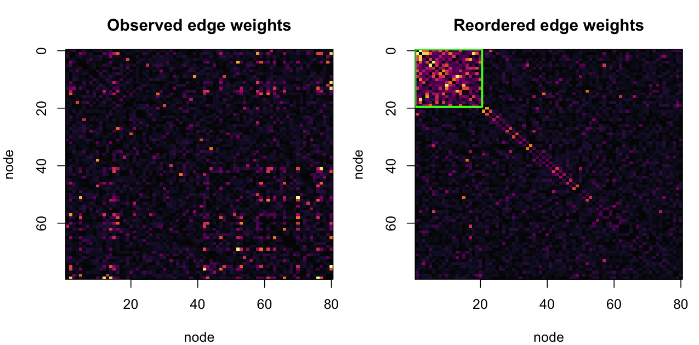
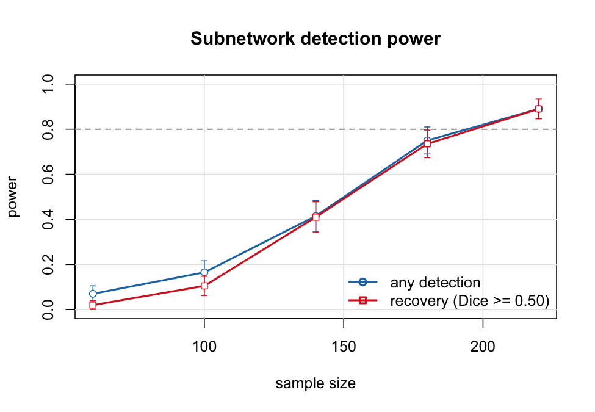

# subnetr

**Find the subnetwork of the connectome that tracks your predictor, and
work out how many subjects you need to find it.**

Mass-univariate testing of a connectome asks each of ~20,000 edges
whether it relates to a predictor, then pays a brutal multiplicity
price. `subnetr` asks a different question: is there a *set of regions*
whose mutual connections are associated with the predictor? Edges are
screened into a weighted graph, a generalized densest-subgraph objective
is optimized by greedy peeling to pull out candidate subnetworks, and a
max-statistic permutation test assigns each one a
family-wise-error-controlled p-value.

The whole pipeline is fast enough to run thousands of times, which is
what makes the other half of the package possible: simulation-based
**power analysis**, so you can size a study before you run it.

## Installation

``` r

# install.packages("remotes")
remotes::install_github("xavienzo/subnetr")
```

## A five-line analysis

Start from subject-level connectivity — an `n_subject` by `n_edge`
matrix of vectorized connectomes — plus a predictor and any nuisance
covariates.

``` r

library(subnetr)

sim <- simulate_fc(n = 120, n_nodes = 80, cluster_size = 20,
                   f2 = 0.1, seed = 2024)

W   <- sim$W                      # -log10 p per edge; edge_stats() builds this
fit <- subnet(W, n_perm = 999, seed = 1)

fit
#> Predictor-associated subnetworks
#> 
#>   nodes       : 80   edges: 3160
#>   objective   : sicers (lambda = 0.50)
#>   threshold   : 1.417   (10.0% of edges retained)
#>   permutations: 999   alpha: 0.05
#>   tuning      : calibrated criterion
#> 
#>  subnet size edges density p_value significant log10_stat
#>       1   20   137   0.721   0.001        TRUE      -91.8
#>       2   45    86   0.087   1.000       FALSE        0.0
#>       3    4     2   0.333   1.000       FALSE       -0.9
#>       4    4     2   0.333   1.000       FALSE       -0.9
#> 
#> 1 of 4 subnetworks significant at FWER 0.05.
#> P-values are max-statistic permutation p-values and are already
#> family-wise-error corrected; do not adjust them again.
```

The detected subnetwork lines up with the planted one:

``` r

dice(fit$subnetworks[[1]], sim$truth$nodes[[1]])
#> [1] 1
```

From raw data,
[`edge_stats()`](https://xavienzo.github.io/subnetr/reference/edge_stats.md)
is the step that produces `W`:

``` r

W <- edge_stats(fc, x = predictor, covariates = cbind(age, sex, motion))
fit <- subnet(W, n_perm = 999)
```

[`plot()`](https://rdrr.io/r/graphics/plot.default.html) reorders the
matrix so the subnetworks sit in blocks on the diagonal and outlines the
significant ones.

``` r

op <- par(mfrow = c(1, 2), mar = c(4, 4, 3, 1))
plot(fit, what = "observed")
plot(fit)
```



plot of chunk heatmap

``` r

par(op)
```

## Power analysis

The question a study designer actually has is “how many subjects?”.
[`power_curve()`](https://xavienzo.github.io/subnetr/reference/power_curve.md)
answers it by simulating the whole pipeline across a grid of sample
sizes.

``` r

pw <- power_curve(n = c(60, 100, 140, 180, 220),
                  n_nodes = 100, cluster_size = 15, f2 = 0.02,
                  n_sim = 200, n_perm = 199, seed = 7, progress = FALSE)

pw
#> Power analysis for subnetwork detection
#> 
#>   nodes           : 100
#>   planted subnets : 15 (sizes)
#>   effect size f2  : 0.02
#>   rho_in / rho_out: 0.90 / 0.020
#>   replicates      : 200   permutations: 199   alpha: 0.05
#>   Dice cutoff     : 0.50
#> 
#>    n         power      recovery  dice n_sig
#>   60 0.070 (0.018) 0.020 (0.010) 0.028  0.07
#>  100 0.165 (0.026) 0.105 (0.022) 0.100  0.16
#>  140 0.415 (0.035) 0.410 (0.035) 0.323  0.42
#>  180 0.750 (0.031) 0.735 (0.031) 0.597  0.76
#>  220 0.890 (0.022) 0.890 (0.022) 0.752  0.89
#> 
#> Power and recovery show the estimate with its Monte Carlo standard
#> error in parentheses.
plot(pw, target = 0.8)
```



plot of chunk power

``` r

required_n(pw, target = 0.8)
#> [1] 196.7742
```

Two power curves are reported, and the distinction matters. **Any
detection** is conventional power: something was declared significant.
**Recovery** additionally requires the significant subnetwork to
actually overlap the true one (Dice ≥ 0.5 by default). A study can
comfortably clear the first bar while failing the second — big enough to
see that something is there, too small to say where.

One warning worth taking seriously: nothing moves power as much as where
the screening threshold sits. A subnetwork of `c` nodes spans `c(c-1)/2`
edges, and if screening retains fewer edges than that in the whole
graph, no sample size will recover it. In an 80-node connectome with a
20-node subnetwork at f² = 0.06 and n = 120, recovery runs 0.30 at the
99th percentile, 0.95 at the 97.5th and 1.00 at the 95th — from the
threshold alone, because the subnetwork spans 190 edges while the 99th
percentile keeps only 32 in the entire graph.
[`power_curve()`](https://xavienzo.github.io/subnetr/reference/power_curve.md)
scales its default with the design to keep this from silently dominating
the answer, but any power you quote is a statement about a particular
screening choice. Set `tune_each = TRUE` to simulate the procedure you
will actually run, threshold selection included.

## What changed relative to the MATLAB implementation

This package is a reimplementation of the `Subnet` MATLAB tool, not a
transliteration. Four changes are worth knowing about.

### 1. `lambda` had no effect

The reference `greedy_peeling_v2.m` scores a candidate set as

``` matlab
score_temp = (sum_wp_temp / 2) ./ ((N - ite) * (2 * lambda));
```

`lambda` is fixed within a call, so dividing by `2 * lambda` is a
positive constant and cannot move the `argmax`. The objective is
therefore Charikar’s average degree, with `lambda` inert — which also
makes the `lambda` search in `param_tuning.m` a no-op that always
returns the first grid value.

`subnetr` restores the generalized objective of Chen et al. (2023),
`(w/m)^lambda * w^(1-lambda)`, where `lambda` genuinely trades block
density against block size. The original behaviour is still available
for reproducing published results:

``` r

subnet_extract(W, threshold, objective = "avg_degree")
```

### 2. Tuning on the data inflated the type-I error

Selecting the threshold and `lambda` from the same matrix you then test,
while the permutation null is computed at the selected values only, is
optimistic: the search got to find the most structured-looking setting
and the null never did. Under the global null this roughly doubles the
error rate.

`subnetr` makes every permutation run the same parameter search the
observed data ran. Measured over 400 null replicates at 60 nodes:

| null                        | nominal 0.05 | nominal 0.10 | nominal 0.20 |
|-----------------------------|--------------|--------------|--------------|
| `"selected"` (as published) | 0.100        | 0.177        | 0.315        |
| `"grid"` (conservative)     | 0.013        | 0.020        | 0.033        |
| `"retune"` (**default**)    | 0.035        | 0.087        | 0.207        |

`"retune"` is not just valid but calibrated, and it keeps most of the
power the invalid version appeared to have — at f² = 0.035 it recovers
the planted subnetwork 26.5% of the time versus 28.0% for the
uncorrected test and 20.0% for the conservative one.

The trick that makes it affordable: the tuning rule is a fixed function
once its null moments are known, and those moments describe the very
distribution a permuted data set is drawn from, so they are estimated
once and reused instead of being re-estimated inside every permutation.

### 3. The screened graph is sparse, so stop storing it densely

Screening keeps a high quantile of the edge weights — the top 1% is
typical. The reference implementation still carries a dense `N × N`
matrix and reallocates a shrinking copy of it at every node removal. At
400 nodes screened at the 99th percentile that is 79,800 matrix entries
visited to reach 798 real edges.

`subnetr` keeps the screened graph in compressed-row form and peels with
a lazily-updated min-heap, so a peeling pass costs `O(E log E)` instead
of `O(N²)`. Permutations get the same treatment: permuting the screened
weight vector and keeping its non-zeros is, in distribution, the same as
choosing `E` of the `M` positions at random and dealing the surviving
weights into them, so a permutation costs `O(E)` rather than `O(N²)`.

| nodes | 100 permutations, reference | `subnetr` | speedup |
|-------|-----------------------------|-----------|---------|
| 100   | 0.12 s                      | 0.009 s   | 14×     |
| 200   | 0.33 s                      | 0.039 s   | 8×      |

The baseline is a line-by-line R port of `greedy_final_v2.m`
(`tests/testthat/helper-reference.R`), which is already fully
vectorized; the compiled core is checked against it for exact agreement
in the test suite. Run `Rscript benchmarks/benchmark.R` to reproduce.

### 4. Power analysis does not need subject-level data

Simulating a study by building an `n × n_edge` matrix and regressing
every column is wasteful when all you need is the edge statistics. Under
the linear model with fixed design, an edge with effect size f² has

``` math
t \sim t_{df}(\mathrm{ncp}), \qquad \mathrm{ncp} = \sqrt{f^2 S}, \qquad
S \sim \chi^2_{n-1-q},
```

with `S` drawn once per data set — which is exactly what couples all the
edges through the shared predictor.
[`simulate_fc()`](https://xavienzo.github.io/subnetr/reference/simulate_fc.md)
samples from this directly. It is exact, not an approximation, and it is
what makes 40,000 pipeline fits run in about three seconds on one core.

`method = "data"` still builds the full subject-level data set when you
need it, including a `edge_corr` knob for cross-edge dependence.

## Reproducibility and parallelism

Every permutation seeds its own RNG stream from its absolute index, so
results depend on `seed` alone — never on `n_cores`, and never on how
work was chunked across workers. This is asserted in the test suite.

``` r

subnet(W, n_perm = 999, seed = 1, n_cores = 8)   # identical to n_cores = 1
```

The permutation loop uses OpenMP where the toolchain provides it and
forked R workers otherwise.
[`has_openmp()`](https://xavienzo.github.io/subnetr/reference/has_openmp.md)
reports which you have. The default Apple clang on macOS ships without
OpenMP, so `n_cores` there uses forked workers.

## References

Chen S, Zhang Y, Wu Q, Bi C, Kochunov P, Hong LE (2023). Identifying
covariate-related subnetworks for whole-brain connectome analysis.
*Biostatistics*, kxad007.

Wu Q, Huang X, Culbreth AJ, Waltz JA, Hong LE, Chen S (2022). Extracting
brain disease-related connectome subgraphs by adaptive dense subgraph
discovery. *Biometrics* 78(4), 1566–1578.

## License

MIT
